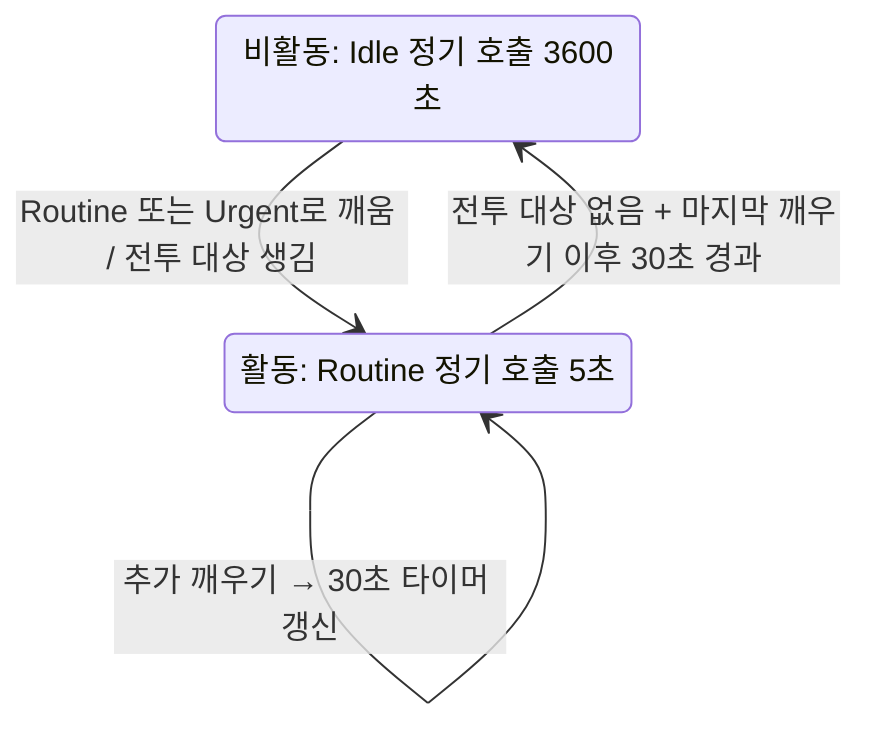
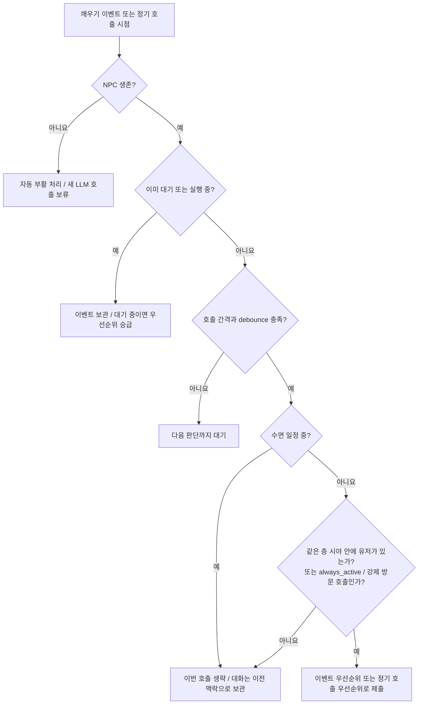
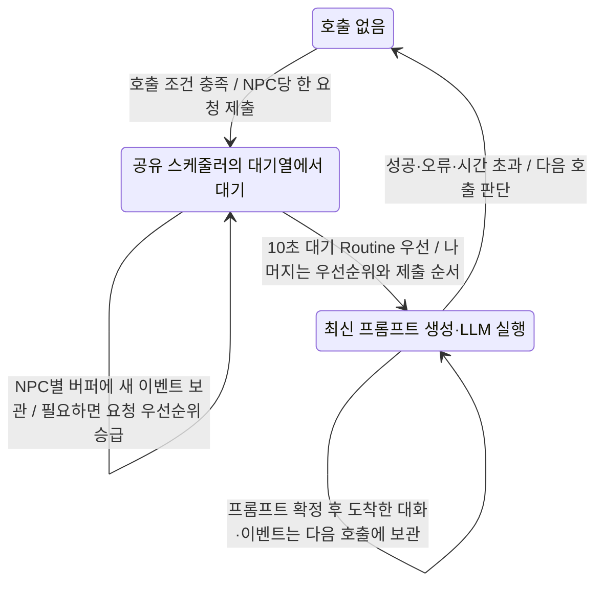

# NPC & Monster AI Architecture

현재(2026-09-19, 프로토콜 85) 몬스터 AI는 서버 전용이다. 몬스터 소유·배정과 클라이언트 AI 실행 코드는 제거했다. agent-client는 NPC 캐릭터의 LLM·이동·전투만 담당한다. 일반 스폰은 같은 층의 주변 생존 수(`maxNearbyMonsters`, 기본 8)로 제한하고, 가시성·던전 생명주기로 제거한다. 현재 구조는 [SERVER_SIDE_MONSTER_AI.md](SERVER_SIDE_MONSTER_AI.md)를 따른다.

아래는 이전 단계의 설계 기록이며, 몬스터 소유 모델과 클라이언트 AI 설명은 폐기되었다.

## 대원칙

**서버는 client와 agent-client를 구분하지 않는다.** WebSocket으로 오가는 프로토콜은 완전히 동일하다. 서버 입장에서 NPC든 PC든 모두 같은 `Player`이고, 같은 `ClientMessage`/`ServerMessage`를 주고받는다.

## WS 스케일링

- 서버는 연결 상한 없음. 연결당 비용: tokio task 1개 (~1-2KB) + broadcast receiver
- Broadcast는 `tokio::broadcast` 사용, 메시지 직렬화 1회 + zero-copy 전달
- **100+ 연결 문제없음**, 10K도 OS 튜닝으로 가능
- 현재 프로토콜은 1 WS = 1 캐릭터 강제 → **NPC당 1 WS 유지**

## 아키텍처: Hybrid Orchestrator

```
Orchestrator Process
  ├── WS Connection 1 (NPC "경비병")  → SharedState_1 → 소유 몬스터
  ├── WS Connection 2 (NPC "상인")    → SharedState_2 → 소유 몬스터
  ├── WS Connection 3 (NPC "의뢰인")  → SharedState_3 → 소유 몬스터
  │
  ├── Monster AI Engine (game loop tick, 각 연결의 소유 몬스터를 독립 구동)
  │     └── 상태머신: Idle → Walk/Run → Attack (chase) → Hit → Flee → Return → Idle
  │     └── 몬스터 소유는 WS 연결(=player) 단위, 서버 전체 상한 공유
  │
  └── LLM Scheduler
        ├── Priority queue (urgent 우선, Routine 10초 대기 시 먼저 처리)
        ├── max_concurrent: 동시 LLM 호출 수 (기본 4)
        ├── request_timeout_secs: 호출당 상한 (기본 120, 슬롯 점유 방지)
        └── NPC별 개별 system prompt + 대화 기억
```

### 몬스터 소유 모델

서버가 몬스터 스폰을 결정하고 소유자를 지정한다 (치팅 방지). 클라이언트는 할당받은 몬스터의 AI(이동/공격)만 담당한다.

**2026-08-25부터 뇌는 서버에서 돈다** ([SERVER_SIDE_MONSTER_AI.md](SERVER_SIDE_MONSTER_AI.md), `serverMonsterAi` 플래그). 아래 소유 모델은 서버 내부 장부(스폰 캡, despawn)로만 남고, 클라이언트에는 `owner_id: None`으로 전달되어 어떤 클라도 뇌를 만들지 않는다. 플래그 off일 때만 아래가 클라이언트에 그대로 적용된다.

**스폰 흐름** (위치 선정까지 전부 서버, [REPEAT_FARMING.md](REPEAT_FARMING.md)):
1. 이동 틱마다 그 틱에 걸어간 거리 `d`로 `1 - 0.98^d`를 굴린다 — 서 있으면 0
2. 성공하면 서버가 진행 방향 화면 가장자리 바로 밖(화면 정렬 정사각형의 변, 반변 20m)에
   후보점을 하나 뽑는다
3. 검증: 노스폰 존 + 마을 거리 게이트, 지면 재질(`SplatSampler`), 물, 그리고 플레이어까지
   1m 셀 워크로 도달 가능한지. 하나라도 걸리면 그 굴림은 버린다 (재시도 없음)
4. `ServerMessage::MonsterAssigned { monster }` → 소유자에게 직접 전송
5. `ServerMessage::MonsterSpawned { monster }` → AOI 안 전원에게 전송
6. 클라이언트는 할당된 몬스터에 대해 `MonsterMove`/`MonsterAttack` 전송

이 규칙은 웹 클라이언트와 agent-client 모두 동일하게 적용.

**소유권 자가 치유**: 핸드오프는 실제 직전 소유자에게 `MonsterRemoved`를 보내고(경합에서 계획이 어긋나도), 그 소유자가 아직 AOI 안이면 `MonsterSpawned`로 관전자 시점을 복원한다. 소유권 변경 2초 유예 이후의 비소유자 `MonsterMove`는 무시 대신 release(`MonsterRemoved`[+`MonsterSpawned`])로 응답해 낡은 brain을 내리게 하며, 클라이언트도 `MonsterMoved.owner_id`가 자신이 아니면 brain을 제거한다.

## 2계층 AI 시스템

| 계층 | 대상 | 방식 | 비용 |
|------|------|------|------|
| Deterministic | 몬스터 (patrol, chase, attack) | 상태머신 | 0원 |
| Deterministic | NPC 전투 (chase, attack loop) | 기존 tick_combat | 0원 |
| LLM | NPC 대화, 고수준 판단 | per-NPC LLM call | $$$ |

같은 대상을 쫓는 몬스터들이 겹쳐 서지 않게 하는 설계는 [MONSTER_SEPARATION.md](MONSTER_SEPARATION.md).

## 3계층 프롬프트 시스템

| 계층 | 파일 | 내용 | 갱신 |
|------|------|------|------|
| Template | `templates/guard.txt` | 역할 공통 프롬프트 (경비병의 일반 행동 규칙) | 개발자가 수동 |
| Instance | `instances/karl.txt` | 개체 고유 정보 (이름, 나이, 성격, 말투, 배경) | 개발자가 수동 |
| Memory | `memory/karl.txt` | 게임 내 경험 기억 (만난 사람, 사건, 감정) | LLM이 자동 갱신 |

LLM 호출 시 system prompt = `template + instance + memory` 순서로 결합.
Memory는 LLM 응답에 `memory_update` 필드를 추가하여 자동 갱신 (append 또는 요약 교체).

## LLM Scheduler 규칙

1. 공유 스케줄러는 빈 슬롯마다 `10초 이상 대기한 Routine → Urgent → 나머지 Routine → Idle` 순서로 요청을 선택한다. 같은 그룹에서는 먼저 제출한 요청이 먼저다.
2. 동시 호출 수는 기본 4개다. Urgent도 호출 간격 제한과 빈 슬롯을 기다리며, 실행 중인 호출을 중단시키지 않는다.
3. NPC마다 공유 스케줄러에서 대기하거나 실행 중인 호출은 하나만 유지한다. 대기 중 이벤트가 오면 해당 NPC의 버퍼에 보관하고 기존 호출 요청의 우선순위를 올릴 수 있다.
4. 새 이벤트가 없어도 활동 중에는 기본 5초, 비활동 중에는 기본 1시간 주기로 호출 기회를 만든다. 아래 호출 허용 조건을 통과해야 실제 요청을 제출한다.
5. 프롬프트는 슬롯을 얻은 뒤 최신 상태와 대화로 만든다. 전투·이동 등의 실행은 LLM 응답 대기와 별도로 진행한다.

## NPC 상태 전환과 호출 흐름

아래 시간은 설정 기본값이며 실제 응답까지는 큐 대기와 생성 시간이 추가된다.

### 활동·비활동 전환

여기서 **활동 상태는 LLM 호출 빈도를 정하는 상태**다. NPC가 걷거나 일하는 모습, 수면 상태와는 별개다.
드라이버는 전투 대상이 있거나 마지막 깨우기 이후 `activity_window_secs`(30초)가 지나지 않았으면 활동 상태로 판단한다.



정기 LLM 호출 자체는 활동 타이머를 갱신하지 않는다. 그 호출로 시작한 NPC 행동에서 이동 완료 등의 깨우기 이벤트가 생기면 갱신한다.
일반 채팅이 끊겼어도 다른 깨우기 이벤트나 전투가 이어지면 활동 상태를 유지한다.

| 계기 | 깨우기와 우선순위 | 대화·활동 처리 |
|---|---|---|
| 들을 수 있는 주변 유저의 일반 채팅 | Routine | 비활동에서도 다시 깨우고, 발언마다 활동 타이머 갱신 |
| 유저가 NPC 이름·별칭 언급 | Urgent | 대화를 모아 우선 응답, 활동 타이머 갱신 |
| 수신 귓속말·파티 채팅, 거래 요청·결과, NPC 피격 등 | Urgent | 기존 긴급 처리 유지, 활동 타이머 갱신 |
| 같은 층 10m 이내의 새 접근 (`PlayerNearby`) | Routine | 활동 타이머 갱신, 상인은 인사 여부 판단 |
| NPC 자신의 이동 완료, 시간대 변경 등 깨우기 이벤트 | Routine | 활동 타이머 갱신 |
| 다른 NPC의 일반 채팅 | 깨우지 않음 | 대화 맥락으로 보관. NPC 회의 중에는 Urgent |
| 자신의 일반 채팅, 들리지 않는 먼 거리 채팅 | 깨우지 않음 | 활동 타이머를 갱신하지 않음 |

접근 감지는 같은 플레이어에 대해 중복 발생하지 않으며, `PlayerLeft` 또는 `PlayerDisappeared`를 받으면 감지 기록을 지운다.
주변에 계속 머물던 손님도 이름 없이 말을 다시 시작하면 일반 채팅의 Routine 깨우기로 활동 상태에 돌아온다.

### 새 호출을 제출할 조건

깨우기는 드라이버에 판단을 요청하는 신호다. 아래 조건에 따라 실제 호출은 생략하거나 기다릴 수 있다.



일반 호출의 최소 간격은 `min_interval_secs=5`, Urgent가 기다릴 때는 `urgent_min_interval_secs=2`다.
간격은 직전 호출 완료를 확인한 시점부터 계산하므로 정확히 5초마다 응답한다는 뜻은 아니다.
비활동의 정기 호출 간격은 `idle_interval_secs=3600`이지만, 새 깨우기 이벤트는 1시간을 기다리지 않고 일반·긴급 최소 간격을 적용한다.
`debounce_secs`는 기본 0이며, 병상·테이블 방문을 위한 강제 호출은 간격·debounce와 주변 유저 조건을 건너뛴다. 수면 조건은 유지한다.

접속 직후에는 초기 프롬프트를 별도로 한 번 시도한다. 이때도 수면·주변 유저 조건을 확인한다.
위 조건은 새 요청 제출 시점에 적용하며, 이미 대기열에 넣었거나 실행 중인 요청을 수면·주변 유저 변화만으로 취소하지는 않는다.

### 요청 대기·실행과 대화 전달

**공유 스케줄러의 대기 요청**은 Codex 등 LLM 백엔드에 전달하기 전 실행 슬롯을 기다리는 호출 요청이다.
대화·이벤트는 NPC별 버퍼에 보관하고, 공유 스케줄러는 어느 NPC의 호출을 먼저 실행할지 정한다.
슬롯을 확보하면 해당 NPC의 버퍼를 읽어 프롬프트를 만든 뒤 백엔드에 전달한다.

활동·비활동과 요청 우선순위는 별개다. 활동 중 정기 호출은 보통 Routine, 비활동 중 이벤트 없는 정기 호출은 Idle이며, 함께 쌓인 이벤트가 있으면 더 높은 우선순위를 적용한다.



공유 스케줄러의 대기 요청은 `Idle → Routine → Urgent` 방향으로만 승급하며, 승급해도 원래 제출 시각을 유지한다.
Routine이 제출 후 10초 이상 기다리면 다음 빈 슬롯을 Urgent보다 먼저 배정한다. 해당 요청의 분류는 Routine으로 유지한다.
이 조건을 충족한 Routine이 여러 개면 제출 시각이 오래된 순서로 처리한다. 기준은 최초 제출 시각이므로 오래 기다린 Idle 요청이 Routine으로 승급한 경우에도 적용한다.
Idle은 기다린 시간만으로 먼저 처리하지 않는다.

10초는 큐에서 먼저 선택할 기준이며 응답 완료 시간이나 대기 시간의 상한이 아니다. 실행 중인 호출을 중단하지 않으므로 슬롯이 빌 때까지는 기다린다.
일반 호출 간격을 기다리는 시간과 백엔드 생성 시간은 큐 대기 시간에 포함하지 않는다.
실행 로그의 `routine_overdue=true`는 이 규칙으로 우선 처리할 조건을 충족했음을 나타낸다.

실행 직전에 이전 대화 최대 30줄, 새 대화 최대 30줄, 현재 이벤트와 상태를 함께 읽는다.
이름 없이 시작한 대화에도 자연스러운 응답이 필요하면 답하도록 지시하며, 모든 발언에 반드시 답하도록 하지는 않는다.
프롬프트에 포함한 새 대화는 이전 맥락으로 옮기고, 이후에 도착한 발언은 다음 호출에 남긴다.

예를 들어 손님이 다가오면 Routine으로 깨어 인사할 수 있다. 손님이 “이거 얼마예요?”라고 이어 말하면 다시 Routine으로 깨우고 활동 시간을 갱신한다.
이후 깨우기 없이 30초가 지나 비활동으로 전환돼도 “하나 주세요”라는 새 발언이 오면 다시 활동 상태로 돌아온다. 이름을 부르면 같은 대화 맥락을 Urgent로 처리한다.

구현: [드라이버](../agent-client/src/driver/mod.rs), [이벤트 분류·깨우기](../agent-client/src/state/events.rs), [접근 감지·대화 보관](../agent-client/src/state/social.rs), [스케줄러](../agent-client/src/llm_scheduler.rs).
설정과 프롬프트 구성은 [AGENT_CLIENT.md](AGENT_CLIENT.md#채팅-맥락과-llm-호출)를 참고한다.

## Config 구조

```toml
server = "ws://localhost:10006"

# id는 data-src/npcs.csv의 레지스트리 항목. 이름·클래스와 프롬프트 경로
# (data/templates/{class}.txt, data/npcs/{id}/instance.txt|memory.txt|favor.json)는
# 거기서 유도되고, template_prompt/instance_prompt/memory_file/favor_file로 덮어쓸 수 있다.
[[npcs]]
id = "karl"
account = "npc_guard"
llm = "openrouter"

[[npcs]]
id = "rica"
account = "npc_merchant"
llm = "openrouter"

# 몬스터 스폰은 서버가 결정 — 클라이언트 config에서 제거
# 서버 config에서 스폰 규칙 정의 (어떤 몬스터, 몇 마리, 어디에)

[llm_scheduler]
max_concurrent = 4
min_interval_secs = 5
```

## 구현 Phase

### Phase 1: Monster AI Module ✅ 구현 완료

**서버 측:**
- 스폰 규칙 시스템: `world.json`의 `ambientSpawns` 배열로 타입 정의
- `ambient_spawn.rs`: 이동 거리에 비례해 스폰을 허가하고, 위치도 서버가 고른다
  - 동시 생존은 `maxMonstersPerPlayer`가 그대로 상한이다
  - 타입은 **스폰 지점**의 마을 거리가 (몬스터 레벨 − 1) × 70m 이상인 것 중에서 고른다
    (`min_ambient_town_distance`, [COMBAT.md](COMBAT.md)의 거리 게이트).
    레벨은 `monsters.csv`에서 오므로 규칙마다 따로 적지 않는다
- `MonsterAssigned` → 소유자에게 직접 전송, `MonsterSpawned` → 전체 브로드캐스트
- 전투 검증: 서버가 공격 판정(hit/miss, 데미지 roll), 쿨다운 체크, HP 관리, 사망 처리
- 사망 몬스터 30초 후 자동 제거 (`MonsterRemoved`)
- 몬스터 ID 형식: `m{owner_number}_{spawn_count}`

**클라이언트 측 (web client + agent-client 동일 로직):**
- `monsterManager.ts` (TS) / `monster_ai.rs` (Rust) 양쪽 모두 behavior tree 런타임을 사용
- 내부 상태: `idle` → `walk`/`run` → `attack` (chase) → `hit` → `flee` → `return` → `idle` / `dead`
  - **idle**: 1초 간격 체크, 30% 확률로 이동 전환
  - **walk/run**: A* 경로 탐색 + waypoint 추적, 도착 시 50% idle / 50% 새 이동
  - **attack**: `chaseRange` 내 타겟 추적, 500ms 간격 경로 재계산, `attackRange` 도달 시 공격
  - **hit**: ~800ms 스태거 후 → HP 30% 이하면 flee, 아니면 attack 복귀
  - **flee**: 공격자 반대 방향으로 runSpeed 도주, 공격자와의 거리가 안전거리(`safeDist`, 기본 chaseRange+5m) 밖이 될 때까지 계속(경로 소진 시 재계산, `maxDurationMs` 기본 15초 페일세이프). 공격자 위치를 모르면 스폰 지점으로 도주. 네트워크 상태: `run`
  - **return**: 스폰 지점으로 walkSpeed 복귀, 도착(5m 이내) 시 idle. 네트워크 상태: `walk`
  - **dead**: AI 중단, 서버가 30초 후 제거
- **리쉬(leash)**: attack 중 스폰 지점에서 50m 초과 시 → return 전환
- chase 범위 초과 / 타겟 사망·소실 시에도 idle 대신 return (스폰 지점 복귀)
- 이동 거리 2~10, 거리 비례 walk/run 확률 (가까울수록 walk)
- WASM 기반 A* 경로 탐색, 물/절벽 회피
- `MonsterMove`/`MonsterAttack` 메시지로 서버에 동기화
- 원격 몬스터는 `targetPosition` 기반 보간 이동

### Phase 2: Orchestrator Refactor

- `agent-client/src/orchestrator.rs` 생성
- "connect → auth → enter game" 시퀀스를 `NpcConnection`으로 추출
- `[[npcs]]` 배열 config 지원
- HeightSampler, PassabilityCache 공유
- 단일 NPC config도 하위호환 유지

### Phase 3: LLM Scheduler

- `agent-client/src/llm_scheduler.rs` 생성
- NPC별 3계층 프롬프트 (template + instance + memory)
- Priority queue + concurrency limiter
- 기존 `classify_event()` 활용한 우선순위
- idle polling 시차 분산

### Phase 4: 관전 패널

- `agent-client/src/watch.rs` — 127.0.0.1 읽기 전용 HTTP 패널 (`watch_port`)
- NPC별 맵/이벤트 피드/LLM 턴 관찰. 제어 경로는 두지 않는다

## 핵심 파일

- `shared/src/lib.rs` — 프로토콜 타입 정의 (Monster, MonsterState, 메시지 variants)
- `server/src/game_state/monster.rs` — 서버 몬스터 스폰/소유/위치 동기화
- `server/src/game_state/combat.rs` — 서버 전투 판정 (플레이어↔몬스터)
- `server/src/monster_defs.rs` — 생성된 몬스터 정의 로드 (`data/monsters.json`)
- `server/src/world_config.rs` — 월드 설정 로드 (`data-src/world.json` 스폰 규칙)
- `server/src/connection.rs` — 메시지 라우팅 (MonsterMove 등)
- `client/src/lib/managers/monsterManager.ts` — 클라이언트 몬스터 AI FSM (Phase 1 구현체)
- `client/src/lib/network/messageHandlers.ts` — 클라이언트 메시지 핸들러
- `client/src/lib/network/socket.ts` — 클라이언트 네트워크 전송 메서드
- `client/src/lib/types/Monster.ts` — 클라이언트 MonsterData 타입
- `data-src/monsters.csv` — 몬스터 정의 원본 데이터
- `data/monsters.json` — 생성된 몬스터 정의 데이터
- `data-src/world.json` — 월드/스폰 설정
- `agent-client/src/driver.rs` — LLM driver loop, combat tick (스케줄러가 대체 예정)
- `agent-client/src/state.rs` — SharedState 확장 (MonsterBrain 추가 예정)
- `agent-client/src/main.rs` — 세션 라이프사이클 (orchestrator 확장 예정)

## Option 비교 (참고)

### Option 1: NPC 1명당 1 LLM (현재 방식 스케일링)
- N개 agent-client 프로세스 각각 독립 실행
- **장점**: 구현 변경 없음, 완벽한 컨텍스트 격리, 장애 격리
- **단점**: 비용 N배, 중복 world state

### Option 2: 1 LLM이 여러 NPC 동시 조종
- 하나의 프롬프트에 모든 NPC 상태를 넣고 한번에 응답
- **장점**: 비용 효율, NPC 간 협동 가능
- **단점**: 성격 오염, 레이턴시 (전원 블로킹), 컨텍스트 폭발, 단일 장애점

### Option 3: Hybrid Orchestrator (채택)
- 위 아키텍처 참조
